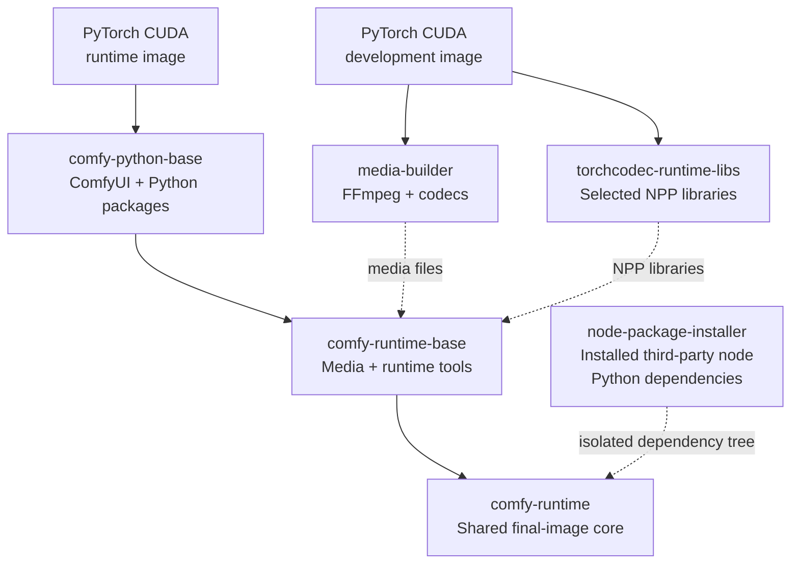
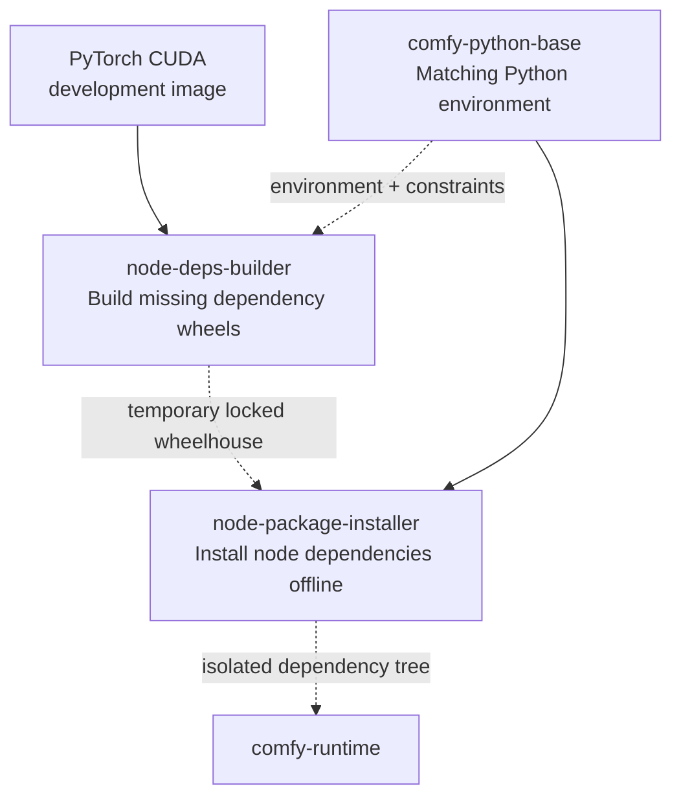
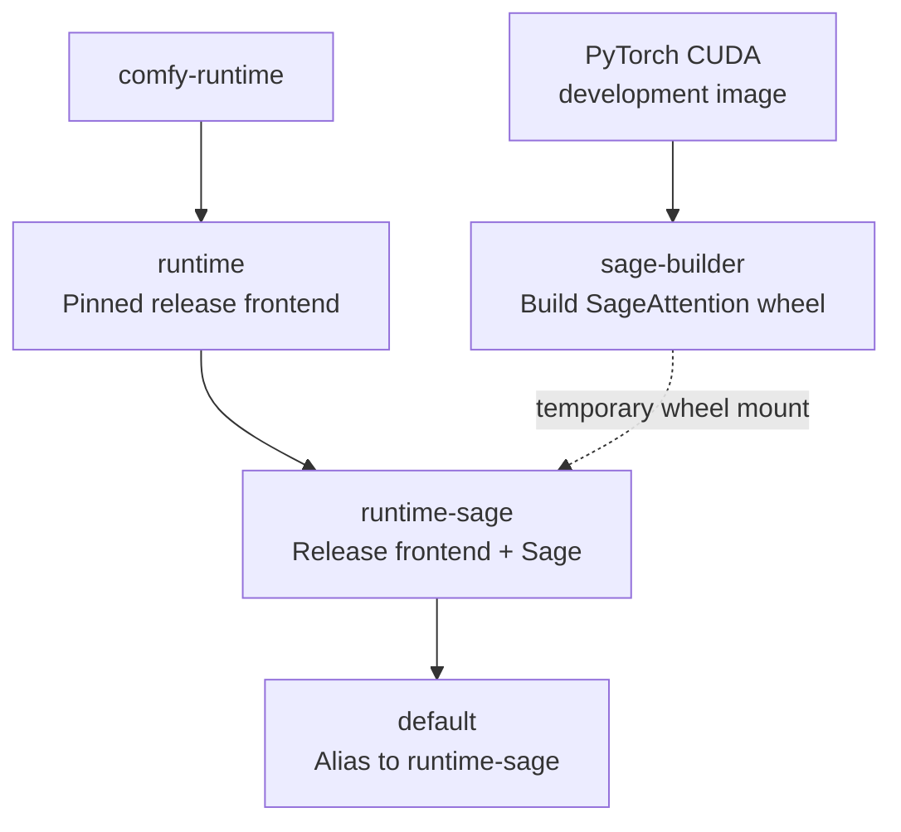
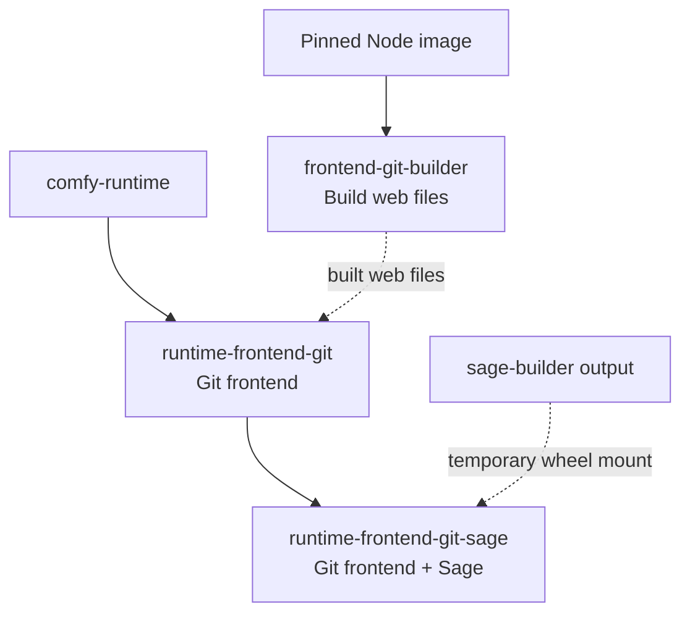

# Image build flow

The ComfyUI Dockerfile uses several stages so compilers, source trees, and
wheel files do not enter the final image. The build is split into four small
diagrams to keep the arrows short. Read each diagram from top to bottom.

Solid arrows mean `FROM`: the next stage builds on the earlier stage. Dotted
arrows pass only the named artifact. A stage may appear in more than one
diagram so each path can be read on its own.

## Shared ComfyUI runtime

## Third-party node Python dependencies

## Pinned release frontend

## Frontend built from Git

## Ready-to-run targets

| Target | Frontend | SageAttention |
|---|---|---:|
| `runtime` | Pinned release | No |
| `runtime-sage` | Pinned release | Yes |
| `runtime-frontend-git` | Exact public Git commit | No |
| `runtime-frontend-git-sage` | Exact public Git commit | Yes |
| `default` | Pinned release | Yes |

Local source mode and prebuilt `dist/` mode mount frontend files when the
container starts. They reuse the release image and do not add Dockerfile
stages.
